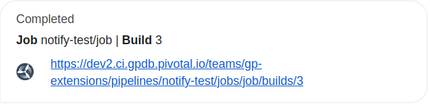
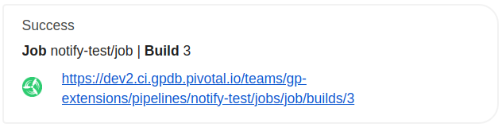
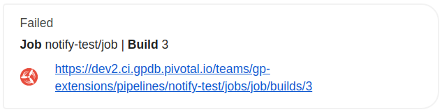
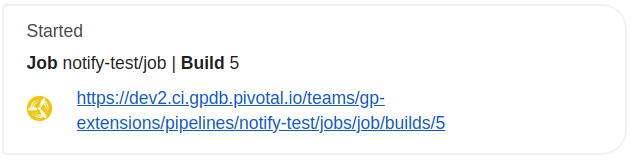
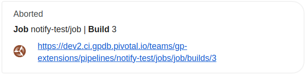
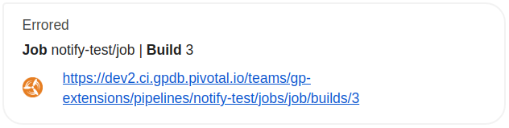

[](https://goreportcard.com/report/github.com/higuoxing/concourse-google-chat-alert-resource)

# concourse-google-chat-alert-resource

A structured and opinionated Google Chat notification resource for [Concourse](https://concourse-ci.org/).



The message is built by using Concourse's [resource metadata](https://concourse-ci.org/implementing-resource-types.html#resource-metadata) to show the pipeline, job, build number and a URL.

## Installing

Use this resource by adding the following to the resource_types section of a pipeline config:

```yaml
resource_types:

- name: gchat-alert
  type: registry-image
  source:
    repository: epic2/concourse-google-chat-alert-resource
```

See the [Concourse docs](https://concourse-ci.org/resource-types.html) for more details on adding `resource_types` to a pipeline config.

## Source Configuration

* `url`: *Required.* Google Chat webhook URL.
* `channel`: *Optional*. Target channel where messages are posted. If unset the default channel of the webhook is used.
* `concourse_url`: *Optional.* The external URL that points to Concourse. Defaults to the env variable `ATC_EXTERNAL_URL`.
* `username`: *Optional.* Concourse local user (or basic auth) username. Required for non-public pipelines if using alert type `fixed` or `broke`
* `password`: *Optional.* Concourse local user (or basic auth) password. Required for non-public pipelines if using alert type `fixed` or `broke`
* `disable`: *Optional.* Disables the resource (does not send notifications). Defaults to `false`.

## Behavior

### `check`: No operation.

### `in`: No operation.

### `out`: Send a message to Google Chat.

Sends a structured message to Google Chat based on the alert type.

#### Parameters

- `alert_type`: *Optional.* The type of alert to send to Google Chat. See [Alert Types](#alert-types). Defaults to `default`.
- `channel`: *Optional.* Channel where this message is posted. Defaults to the `channel` setting in Source.
- `channel_file`: *Optional.* File containing text which overrides `channel`. If the file cannot be read, `channel` will be used instead.
- `message`: *Optional.* The status message at the top of the alert. Defaults to name of alert type.
- `message_file`: *Optional.* File containing text which overrides `message`. If the file cannot be read, `message` will be used instead.
- `text`: *Optional.* Additional text below the message of the alert. Defaults to an empty string.
- `text_file`: *Optional.* File containing text which overrides `text`. If the file cannot be read, `text` will be used instead.
- `disable`: *Optional.* Disables the alert. Defaults to `false`.

#### Alert Types

- `default`

  

- `success`

  

- `failed`

  

- `started`

  

- `aborted`

  

- `errored`

  

- `fixed`

  Fixed is a special alert type that only alerts if the previous build did not succeed. Fixed requires `username` and `password` to be set for the resource if the pipeline is not public.

  

- `broke`

  Broke is a special alert type that only alerts if the previous build succeed. Broke requires `username` and `password` to be set for the resource if the pipeline is not public.

  

## Examples

### Out

Using the default alert type with custom message:

```yaml
resources:
- name: notify
  type: gchat-alert
  source:
    url: https://chat.googleapis.com/v1/spaces/xxx_yyy/messages?key=xxxx_yyy

jobs:
  # ...
  plan:
  - put: notify
    params:
      message: Completed
```

Using built-in alert types with appropriate build hooks:

```yaml
resources:
- name: notify
  type: gchat-alert
  source:
    url: https://chat.googleapis.com/v1/spaces/xxx_yyy/messages?key=xxxx_yyy

jobs:
  # ...
  plan:
  - put: notify
    params:
      alert_type: started
  - put: some-other-task
    on_success:
      put: notify
      params:
        alert_type: success
    on_failure:
      put: notify
      params:
        alert_type: failed
    on_abort:
      put: notify
      params:
        alert_type: aborted
    on_error:
      put: notify
      params:
        alert_type: errored
```

Using the `fixed` alert type:

```yaml
resources:
- name: notify
  type: gchat-alert
  source:
    url: https://chat.googleapis.com/v1/spaces/xxx_yyy/messages?key=xxxx_yyy
    # `alert_type: fixed` requires Concourse credentials if pipeline is private
    username: concourse
    password: concourse

jobs:
  # ...
  plan:
  - put: some-other-task
    on_success:
      put: notify
      params:
        # will only alert if build was successful and fixed
        alert_type: fixed
```
